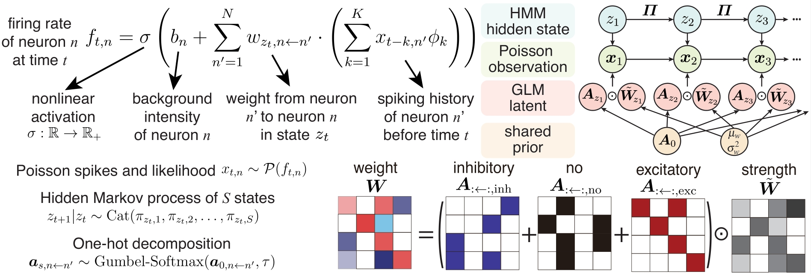

# One-hot Generalized Linear Model for Switching Brain State Discovery [ICLR 2024]
<div align='center' >Chengrui Li, Soon Ho Kim, Chris Rodgers, Hannah Choi, and Anqi Wu</div>

[[paper]](https://openreview.net/pdf?id=MREQ0k6qvD) [[arXiv]](https://arxiv.org/abs/2310.15263) [[slides]](https://jerrysoybean.github.io/assets/pdf/One-hot%20HMM-GLM%20pre.pdf) [[video]](https://recorder-v3.slideslive.com/?share=90866&s=36c13cb1-072a-49bf-a85a-34718072e363) [[poster]](https://jerrysoybean.github.io/assets/pdf/One-hot%20HMM-GLM%20ICLR%202024%20poster.pdf) [[文章]](https://jerrysoybean.github.io/assets/pdf/OnehotHMMGLM_ICLR_2024_%E4%B8%AD%E6%96%87.pdf)



## 1 Installation
From the current directory (which includes this `README.md`), run
```
cd hmmglm
pip install -e .
```

## 2 Tutorial
[hmmglm/hmmglm/deprecated/demo.ipynb](hmmglm/hmmglm/deprecated/demo.ipynb) is a step-by-step tutorial that run naive HMM-GLM, Gaussian HMM-GLM, and one-hot HMM-GLM on a synthetic dataset.

[experiments/synthetic.ipynb](experiments/synthetic.ipynb) is a step-by-step tutorial that run one-hot HMM-GLM (version 0.1.0) on a synthetic dataset.

[experiments/pfc6.ipynb](experiments/pfc6.ipynb) is a step-by-step tutorial that run one-hot HMM-GLM (version 0.1.0) on the [CNCRS pfc-6](https://crcns.org/data-sets/pfc/pfc-6) dataset.
